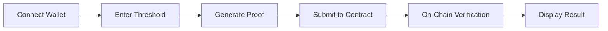

# ZK-Balance — Proof of Funds Without Revealing Balance
[](https://stellar.org)
[](https://docs.circom.io/)
[](https://developers.stellar.org/docs/build/smart-contracts)
[](https://nextjs.org/)
[](LICENSE)

---
## Description
A dApp that lets a Stellar user prove they hold at least a specified minimum balance of a specific asset (e.g. XLM, USDC) without revealing their exact balance. The user generates a ZK proof off-chain, submits it to a Soroban verifier contract, and the contract returns a simple true/false — the user either meets the threshold or they don't. This is the classic "range proof" / "proof-of-balance" pattern — a perfect first ZK project.

Real-world use case: A tenant proving they have enough funds for a security deposit to a landlord, or a trader proving they meet a minimum balance requirement for a DeFi pool, without broadcasting their wallet balance to the world.

# ZK-Balance: Zero-Knowledge Proof of Funds on Stellar

## 📚 Table of Contents

- [Overview](#overview)
- [How It Works](#how-it-works)
- [Architecture](#architecture)
- [Live Demo](#live-demo)
- [Prerequisites](#prerequisites)
- [Project Structure](#project-structure)
- [Installation](#installation)
- [Configuration](#configuration)
- [Deployment](#deployment)
- [Usage](#usage)
- [Testing](#testing)
- [Troubleshooting](#troubleshooting)
- [Resources](#resources)
- [Contributing](#contributing)
- [License](#license)

---

## Overview

**ZK-Balance** is a privacy-preserving decentralized application (dApp) built on the Stellar network that allows users to prove they hold at least a specified minimum balance of an asset (e.g., XLM or USDC) **without revealing their exact balance**. It uses zero-knowledge proofs to verify the condition on-chain while keeping the actual balance private.

### ✨ Key Features

- 🔐 **Privacy-Preserving**: Never reveals your actual balance to anyone
- ⚡ **On-Chain Verification**: Proofs verified using Stellar's native BN254 host functions (Protocol 25/26)
- 🎯 **Threshold Validation**: Proves `balance >= threshold` without disclosing the balance
- 🌐 **Browser-Based Proof Generation**: All ZK computation runs client-side in the browser
- 💳 **Multi-Asset Support**: Works with any Stellar asset (XLM, USDC, EURC, etc.)
- 🚀 **Gas Efficient**: Uses Groth16 proofs with the smallest on-chain footprint

### 🌍 Real-World Use Cases

| Use Case | Description |
|----------|-------------|
| **Proof of Funds** | Prove sufficient funds for a transaction without revealing your balance |
| **KYC/Compliance** | Demonstrate financial eligibility without exposing sensitive data |
| **Private DeFi** | Access DeFi protocols with verified solvency |
| **Airdrop Eligibility** | Verify wallet meets minimum balance requirements |
| **Rental Deposits** | Prove you have enough funds for a security deposit |

---

## How It Works

### User Flow


### Zero-Knowledge Circuit

The Circom circuit implements the core logic:

```circom
// Check if balance >= threshold
lt.in[0] <== balance;   // Private input (never revealed)
lt.in[1] <== threshold; // Public input (visible to verifier)
isValid <== 1 - lt.out; // 1 if balance >= threshold
```

### On-Chain Verification

The Soroban contract uses Stellar's BN254 host functions:
- `bn254_multi_pairing_check`: Verifies the Groth16 proof
- Embedded verification key ensures correct circuit validation
- Explicit `is_valid == 1` check prevents semantic bypass

---

## Architecture

### Technology Stack

| Component | Technology | Purpose |
|-----------|------------|---------|
| **ZK Circuit** | Circom 2.0 | Define the `balance >= threshold` logic |
| **Proof System** | Groth16 | Generate and verify zero-knowledge proofs |
| **Smart Contract** | Soroban (Rust) | On-chain proof verification |
| **Frontend** | Next.js 16 + TypeScript + TailwindCSS | User interface and wallet integration |
| **Wallet** | Freighter | Stellar wallet connection |
| **SDK** | @stellar/stellar-sdk | Stellar network interaction |
| **Network** | Stellar Testnet | Contract deployment and testing |

### Architecture Diagram
```
┌─────────────────────────────────────────────────────────────────────────┐
│                          ZK-Balance Stack                              │
├─────────────────────────────────────────────────────────────────────────┤
│                                                                         │
│  ┌─────────────────────────────────────────────────────────────────┐   │
│  │                    Frontend (Next.js)                           │   │
│  │  ┌─────────────┐  ┌─────────────┐  ┌─────────────────────┐   │   │
│  │  │  Freighter  │  │    snarkjs  │  │  @stellar/stellar-  │   │   │
│  │  │   Wallet    │  │ (WASM/Web)  │  │  sdk               │   │   │
│  │  └─────────────┘  └─────────────┘  └─────────────────────┘   │   │
│  └─────────────────────────────────────────────────────────────────┘   │
│                                    │                                    │
│                                    ▼                                    │
│  ┌─────────────────────────────────────────────────────────────────┐   │
│  │              Soroban Verifier Contract                          │   │
│  │  ┌─────────────────────┐  ┌────────────────────────────────┐   │   │
│  │  │  Embedded VK        │  │  Groth16 Verification Logic   │   │   │
│  │  │  (α, β, γ, δ, IC)   │  │  (BN254 host functions)       │   │   │
│  │  └─────────────────────┘  └────────────────────────────────┘   │   │
│  └─────────────────────────────────────────────────────────────────┘   │
│                                    │                                    │
│                                    ▼                                    │
│  ┌─────────────────────────────────────────────────────────────────┐   │
│  │              Stellar Network (Testnet/Mainnet)                  │   │
│  │  ┌─────────────────────────────────────────────────────────┐   │   │
│  │  │  Protocol 25/26: BN254 Host Functions                   │   │   │
│  │  │  • g1_add, g1_mul                                      │   │   │
│  │  │  • multi_pairing_check                                 │   │   │
│  │  │  • Poseidon/Poseidon2                                  │   │   │
│  │  └─────────────────────────────────────────────────────────┘   │   │
│  └─────────────────────────────────────────────────────────────────┘   │
│                                                                         │
└─────────────────────────────────────────────────────────────────────────┘
```

---

## Live Demo

- **Frontend**: [https://zk-balance.vercel.app](https://zk-balance.vercel.app)
- **Contract**: `CCKF4HGIJZ2T3GJJKJVAWJGFZTZID3LB342DINZH2V2DQT24B5U4HPH7`
- **GitHub**: [holyaustin/ZK-Balance](https://github.com/holyaustin/ZK-Balance)
- **Twitter/X**: [@holyaustin](https://x.com/holyaustin)

---

## Prerequisites

### Required Tools

```bash
# Check versions before starting
node --version     # v20.x or higher
npm --version      # v10.x or higher
rustc --version    # v1.80.x or higher
cargo --version    # v1.80.x or higher
git --version      # v2.x or higher
```

### Install Stellar CLI

```bash
cargo install stellar-cli
stellar --version
```

### Install Circom and snarkjs

```bash
# Install Circom
git clone https://github.com/iden3/circom.git
cd circom
cargo build --release
cargo install --path circom
circom --version

# Install snarkjs
npm install -g snarkjs
snarkjs --version
```

### Create Testnet Account

```bash
# Generate a new keypair
stellar keys generate my-account --network testnet

# Fund it with testnet XLM
stellar keys fund my-account
```

---

## Project Structure

```
zk-balance/
├── zk-circuits/
│   ├── balance_proof.circom     # ZK circuit definition
│   ├── compile.sh                # Circuit compilation script
│   └── setup.sh                  # Trusted setup script
│
├── groth16-verifier/
│   ├── Cargo.toml                # Rust dependencies
│   ├── src/
│   │   └── lib.rs                # Soroban verifier contract
│   └── .stellar/                 # Stellar configuration
│
├── frontend/
│   ├── app/
│   │   ├── page.tsx              # Main page
│   │   ├── layout.tsx            # Root layout
│   │   └── globals.css           # Global styles
│   ├── components/
│   │   ├── ConnectWallet.tsx     # Wallet connection
│   │   ├── BalanceChecker.tsx    # Balance input & proof flow
│   │   └── ResultDisplay.tsx     # Verification result display
│   ├── lib/
│   │   ├── proofGenerator.ts     # ZK proof generation
│   │   ├── verifier.ts           # On-chain verification
│   │   └── stellar.ts            # Stellar helpers
│   ├── public/
│   │   └── circuits/
│   │       ├── balance_proof.wasm
│   │       └── circuit_final.zkey
│   ├── package.json
│   └── .env.local
│
├── scripts/
│   ├── deploy-verifier.js        # Contract deployment
│   ├── extract-vk.js             # Extract VK constants
│   └── test-verifier.js          # Contract testing
│
└── README.md
```

---

## Installation

### 1. Clone the Repository

```bash
git clone https://github.com/holyaustin/ZK-Balance.git
cd ZK-Balance
```

### 2. Build the ZK Circuit

```bash
cd zk-circuits
./compile.sh
./setup.sh
```

This generates:
- `balance_proof.r1cs`: The constraint system
- `balance_proof.wasm`: WebAssembly for witness generation
- `circuit_final.zkey`: Proving key
- `verification_key.json`: Verification key

### 3. Extract Verification Key Constants

```bash
cd ../scripts
node extract-vk.js > vk_constants.txt
```

Copy the hex values from `vk_constants.txt` into the contract's `VK_*` constants in `groth16-verifier/src/lib.rs`.

### 4. Build the Soroban Contract

```bash
cd ../groth16-verifier
cargo build --target wasm32v1-none --release
```

### 5. Install Frontend Dependencies

```bash
cd ../frontend
npm install
```

---

## Configuration

### Environment Variables

Create `frontend/.env.local`:

```env
# Stellar Network Configuration
NEXT_PUBLIC_STELLAR_RPC_URL=https://soroban-testnet.stellar.org
NEXT_PUBLIC_NETWORK_PASSPHRASE=Test SDF Network ; September 2015
NEXT_PUBLIC_VERIFIER_CONTRACT_ID=CCKF4HGIJZ2T3GJJKJVAWJGFZTZID3LB342DINZH2V2DQT24B5U4HPH7
```

### Contract Configuration

In `groth16-verifier/src/lib.rs`, ensure the verification key constants are correctly set:

```rust
// Replace these with your actual VK bytes from extract-vk.js
const VK_ALPHA_G1: [u8; 64] = [ /* your alpha G1 bytes */ ];
const VK_BETA_G2: [u8; 128] = [ /* your beta G2 bytes */ ];
const VK_GAMMA_G2: [u8; 128] = [ /* your gamma G2 bytes */ ];
const VK_DELTA_G2: [u8; 128] = [ /* your delta G2 bytes */ ];
const VK_IC0: [u8; 64] = [ /* your IC0 bytes */ ];
const VK_IC1: [u8; 64] = [ /* your IC1 bytes */ ];
const VK_IC2: [u8; 64] = [ /* your IC2 bytes */ ];
```

---

## Deployment

### 1. Deploy the Verifier Contract

```bash
cd groth16-verifier

# Build the optimized WASM
stellar contract build

# Deploy to testnet
NEW_CONTRACT_ID=$(stellar contract deploy \
  --wasm target/wasm32v1-none/release/groth16_verifier.optimized.wasm \
  --source my-account \
  --network testnet)

echo "Your Contract ID is: $NEW_CONTRACT_ID"
```

**Example Output:**
```
ℹ️  Uploading contract WASM…
ℹ️  Simulating transaction…
ℹ️  Signing transaction: f5f96b735bea346213ca44aa0197ae63784a06682e35656ac4a99588db040afa
🌎 Sending transaction…
✅ Transaction submitted successfully!
🔗 https://stellar.expert/explorer/testnet/tx/f5f96b735bea346213ca44aa0197ae63784a06682e35656ac4a99588db040afa
ℹ️  Deploying contract using wasm hash d4f40a3496aee547394b3910d41ca00b7420c397dfee320439b2a0e0e78cd658
ℹ️  Simulating transaction…
🌎 Sending transaction…
✅ Transaction submitted successfully!
🔗 https://lab.stellar.org/r/testnet/contract/CCKF4HGIJZ2T3GJJKJVAWJGFZTZID3LB342DINZH2V2DQT24B5U4HPH7
✅ Deployed!
Your Real, Secure Contract ID is: CCKF4HGIJZ2T3GJJKJVAWJGFZTZID3LB342DINZH2V2DQT24B5U4HPH7
```

### 2. Verify the Contract Interface

```bash
stellar contract info interface \
  --id CCKF4HGIJZ2T3GJJKJVAWJGFZTZID3LB342DINZH2V2DQT24B5U4HPH7 \
  --network testnet
```

### 3. Update Frontend Environment

Add the contract ID to `frontend/.env.local`:

```env
NEXT_PUBLIC_VERIFIER_CONTRACT_ID=CCKF4HGIJZ2T3GJJKJVAWJGFZTZID3LB342DINZH2V2DQT24B5U4HPH7
```

### 4. Deploy Frontend (Optional)

```bash
cd frontend
npm run build
npm start
```

Or deploy to Vercel:

```bash
vercel deploy
```

---

## Usage

### Local Development

```bash
cd frontend
npm run dev
```

Open [http://localhost:3000](http://localhost:3000) in your browser.

### Step-by-Step User Flow

1. **Install Freighter Wallet**
   - Download from [freighter.app](https://www.freighter.app/)
   - Create a testnet wallet
   - Fund it with testnet XLM

2. **Connect Wallet**
   - Click "Connect Freighter Wallet"
   - Approve the connection

3. **Set Threshold**
   - Enter the minimum balance (e.g., 100 XLM)
   - Select asset type (XLM, USDC, etc.)

4. **Generate Proof**
   - Click "Generate & Verify Proof"
   - The app fetches your balance (kept private)
   - Snarkjs generates a ZK proof in the browser

5. **Verify On-Chain**
   - The proof is submitted to the Stellar testnet
   - The contract verifies the proof using BN254 host functions
   - Result is displayed

### Expected Outputs

**✅ Success:**
```
✅ Proof Verified! You have sufficient balance.
```

**❌ Failure:**
```
❌ Verification Failed. Your balance is below the required threshold.
```

---

## Testing

### Test the Contract

```bash
cd scripts
node test-verifier.js
```

### Test the Frontend

```bash
cd frontend
npm run test  # If tests are configured
```

### Manual Testing Scenarios

| Scenario | Expected Result |
|----------|-----------------|
| Balance ≥ Threshold | ✅ Verification succeeds |
| Balance < Threshold | ❌ Verification fails |
| Invalid Proof | ❌ Contract rejects with error |

---

## Troubleshooting

### Common Errors and Solutions

#### 1. `ERR_NAME_NOT_RESOLVED`

**Error:**
```
GET https://horizon-testnet.stellar.org/accounts/... net::ERR_NAME_NOT_RESOLVED
```

**Solution:** Use the alternative endpoint:
```typescript
const server = new Horizon.Server('https://testnet.stellar.org');
```

#### 2. `HostError: Error(Storage, MissingValue)`

**Error:**
```
Wasm does not exist
```

**Solution:** Upload the WASM separately:
```bash
WASM_HASH=$(stellar contract upload --wasm contract.wasm --source my-account --network testnet)
stellar contract deploy --wasm-hash $WASM_HASH --source my-account --network testnet
```

#### 3. `invalid input vector lengths`

**Error:**
```
multi-pairing-check: invalid input vector lengths 2 and 1
```

**Solution:** Ensure G1 and G2 vectors have the same length (4 points each in the final implementation). Check the contract's `lib.rs` for correct vector construction.

#### 4. Transaction Simulation Failed

**Error:**
```
HostError: Error(Crypto, InvalidInput)
```

**Solution:** 
- Verify the proof format matches what the contract expects
- Check that the verification key constants are correct
- Ensure `is_valid` is being validated as `== 1`

#### 5. Freighter Not Detected

**Error:**
```
Please install Freighter wallet extension
```

**Solution:** 
- Download from [freighter.app](https://www.freighter.app/)
- Ensure it's enabled in your browser
- Refresh the page after installation

### Getting Help

- **Stellar Dev Discord**: [#zk-chat](https://discord.gg/stellardev)
- **GitHub Issues**: [Open an issue](https://github.com/holyaustin/ZK-Balance/issues)
- **Twitter/X**: [@holyaustin](https://twitter.com/holyaustin)
- **Stellar Documentation**: [developers.stellar.org](https://developers.stellar.org)

---

## Resources

### Stellar ZK Documentation
- [ZK Proofs on Stellar](https://developers.stellar.org/docs/build/apps/zk) - Official ZK documentation
- [Privacy on Stellar](https://developers.stellar.org/docs/build/apps/privacy) - Privacy features overview
- [BN254 Host Functions](https://docs.rs/soroban-sdk/latest/soroban_sdk/_migrating/v25_bn254/index.html) - BN254 Rust SDK
- [Poseidon Hash Functions](https://docs.rs/soroban-sdk/latest/soroban_sdk/_migrating/v25_poseidon/index.html) - Poseidon SDK

### ZK Tooling
- [Circom Documentation](https://docs.circom.io/) - Circuit language
- [Snarkjs GitHub](https://github.com/iden3/snarkjs) - JavaScript ZK library
- [Groth16 Verifier Example](https://github.com/stellar/soroban-examples/tree/main/groth16_verifier) - Reference implementation

### Stellar Development
- [Stellar CLI](https://developers.stellar.org/docs/tools/developer-tools/stellar-cli) - Command-line tool
- [Freighter Wallet](https://www.freighter.app/) - Stellar wallet
- [Scaffold Stellar](https://scaffoldstellar.org/) - Development scaffold
- [Stellar Testnet Faucet](https://laboratory.stellar.org/#create-account?network=testnet) - Get testnet XLM

### Hackathon Resources
- [Stellar Hacks Info](https://stellar.org/hacks) - Hackathon details
- [Stellar Skills](https://skills.stellar.org/) - Learning resources
- [Stellar Developer Discord](https://discord.gg/stellardev) - Community support

---

## Contributing

Contributions are welcome! Please follow these steps:

1. **Fork the Repository**
   ```bash
   git fork https://github.com/holyaustin/ZK-Balance.git
   ```

2. **Create a Feature Branch**
   ```bash
   git checkout -b feature/amazing-feature
   ```

3. **Commit Your Changes**
   ```bash
   git commit -m 'Add some amazing feature'
   ```

4. **Push to the Branch**
   ```bash
   git push origin feature/amazing-feature
   ```

5. **Open a Pull Request**
   - Go to the repository on GitHub
   - Click "New Pull Request"
   - Describe your changes

### Development Guidelines

- Follow TypeScript best practices
- Write meaningful commit messages
- Update documentation as needed
- Test your changes thoroughly

---

## License

This project is licensed under the MIT License - see the [LICENSE](LICENSE) file for details.

---

## Acknowledgments

- **Stellar Development Foundation** - For the BN254 host functions and Soroban smart contract platform
- **Nethermind** - For the Stellar Private Payments reference implementation
- **Iden3** - For Circom and snarkjs
- **Stellar Community** - For feedback and support during development

---

## Contact

- **Developer**: holyaustin
- **GitHub**: [holyaustin](https://github.com/holyaustin)
- **Twitter/X**: [@holyaustin](https://twitter.com/holyaustin)
- **Project Link**: [https://github.com/holyaustin/ZK-Balance](https://github.com/holyaustin/ZK-Balance)

---

## ⚠️ Disclaimer

This project is for **demonstration and educational purposes**. It has not been audited for production use. **Do not use with real assets on mainnet without proper security review.**

---

**Built with ❤️ for the Stellar Hacks**
